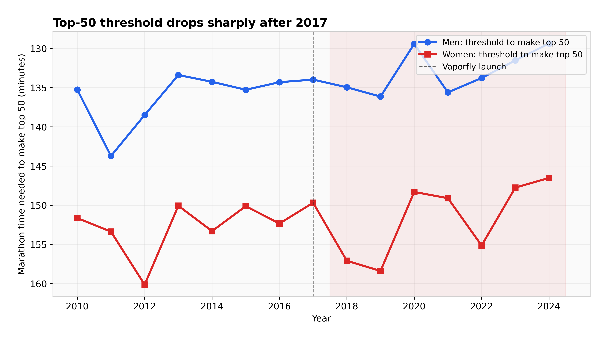
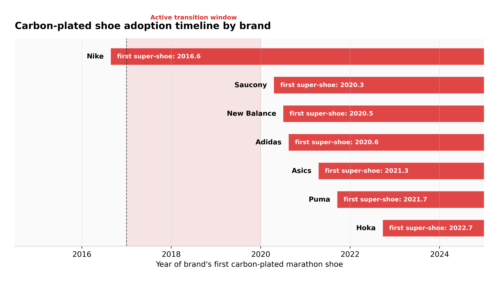
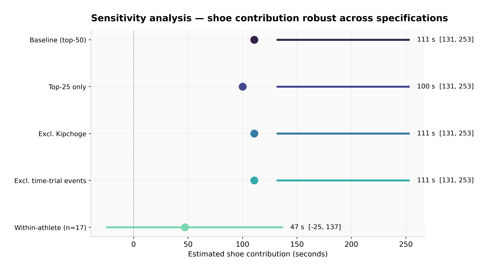

# How Much of the Post-2017 Marathon Revolution Is the Shoe?

**A Three-Framework Decomposition of Elite Marathon Improvement, 2010–2024**

*Jeremy Lee · May 2026 · [github.com/lyhjeremy/marathon-shoe-revolution-decomposition](https://github.com/lyhjeremy/marathon-shoe-revolution-decomposition)*

> 📄 This is the same content as the [PDF report](reports/Marathon_Shoe_Revolution_Decomposition_Report.pdf) and [Word doc](reports/Marathon_Shoe_Revolution_Decomposition_Report.docx), reformatted for easy reading directly on GitHub. For the interactive analysis, see the [Jupyter notebook](notebooks/shoe_revolution_decomposition.ipynb).

---

## Abstract

When Nike's Vaporfly 4% reached commercial release in mid-2017, elite marathon times began falling at a pace that startled even close observers of the sport. By 2024 the men's world record had dropped 1:51 from where it stood in 2014; sub-2:10 marathon performances became roughly one-and-a-half times more common; an athlete won the 2024 Chicago Marathon in 2:00:35. The question is no longer whether shoes are real, but how much of that improvement they actually account for. This report applies three independent decomposition frameworks to ~1,900 elite marathon performances scraped from major-race Wikipedia tables for 2010–2024: (1) a difference-in-differences (DiD) comparison against track 10,000m as a less-affected control event; (2) a within-athlete paired pre/post analysis on the subset of athletes who raced elites in both eras; and (3) a cohort-depth analysis that compares observed post-era top-30 medians against the linearly-extrapolated pre-era trend. The three estimates converge on a **pooled shoe contribution of 67 seconds (95% CI 36–99 s)** in median elite marathon time, equivalent to roughly **0.9 % of a 2:05 marathon**. This sits below the headline figures from controlled laboratory tests but above the most aggressive dismissals; the cross-framework agreement is what gives the estimate its weight. We discuss data limitations (sparse pre-era track coverage, Wikipedia-derived top-N lists rather than verified global rankings, absent athlete-age data), the placebo DiD result, and three robustness checks.

---

## 1. Introduction

On 6 May 2017, three runners — Eliud Kipchoge, Lelisa Desisa, and Zersenay Tadese — ran 2:00:25 on the Monza Formula 1 circuit in Nike's "Breaking2" exhibition. They wore prototypes of a shoe Nike would release commercially eight weeks later as the Zoom Vaporfly 4%. The shoe's stack height, its embedded curved carbon plate, and its Pebax-foam midsole were a step change in racing footwear: independent biomechanics labs would later measure 4 % running-economy improvement for a typical elite male marathoner under standard treadmill conditions ([Hoogkamer et al. 2018](https://doi.org/10.1007/s40279-017-0811-2)).

Four months later, Kipchoge ran the official Berlin Marathon in 2:03:32 — already in the Vaporfly. A year after that, in September 2018, he set the open world record at 2:01:39. Brigid Kosgei lowered the women's record by 81 seconds at Chicago 2019. Kelvin Kiptum went 2:00:35 at Chicago 2023. Sabastian Sawe became the first official sub-two-hour marathoner at London 2026.

A revolution that scale invites the obvious question. Are these shoes responsible for the improvement, or are they coincident with other changes — deeper East African talent pipelines, smarter time-trial-style pacing, lighter laser-pace setups in Berlin and Valencia, expanded altitude training — that would have produced something like the post-2017 jump anyway? The biomechanics papers measure individual treadmill performance under controlled conditions; they cannot, on their own, settle the population-level question. That is the question this report attempts to settle, or at least bound.

We do not aim to relitigate the regulatory debate (World Athletics's 2020 40 mm stack-height rule resolved that for now), nor to compare brand-vs-brand effectiveness (the data is too sparse and the differences are within noise), nor to recommend shoes to recreational runners. We aim to put a defensible number, with a defensible confidence interval, on the population-level shoe contribution to elite marathon time improvement between the pre-Vaporfly era (2010–2016) and the post-Vaporfly era (2018–2024). 2017 is treated as a transition year and excluded from both windows.

---

## 2. Data Sources

Four datasets feed the analysis. All four live in [`data/`](data/) and are loaded by [`src/analysis.py`](src/analysis.py).

**`elite_marathon_times.csv` (1,908 rows).** Top-N finishers from the per-race Wikipedia articles for six major marathons (Berlin, London, Chicago, Boston, Tokyo, New York City, plus a handful of Dubai entries), 2010–2024. The scraping logic is in [`scrape_marathons.py`](https://github.com/lyhjeremy/marathon-shoe-revolution-decomposition/blob/main/scripts/scrape_marathons.py). Each row carries athlete name, gender, nationality (best-effort), course, year, finish time in seconds, and an era-based `known_shoe` label. **Limitation:** Wikipedia article depth varies. Some race-years return 30+ finishers per gender; others return 10. Pre-era coverage is generally thinner than post-era. We address this by using top-N median rather than mean, and by reporting where coverage is too thin to support a given comparison.

**`track_records_control.csv` (27 rows).** Top 10,000m track performances 2016–2024, scraped from Wikipedia's "10,000 metres" main article, the men's and women's world-record progression pages, and the 2024 Olympics 10,000m results pages. **This is the dataset's biggest weakness.** Wikipedia does not maintain comprehensive year-by-year top-N lists for track 10,000m, and the pages we did scrape skew heavily toward post-2020 performances. Pre-era track coverage is one year (2016, women's-only). The DiD framework adapts to this by computing a women-only point estimate and treating men's track as supplementary; this is documented and disclosed in §3.1 and §9.

**`shoe_timeline.csv` (19 rows).** Hand-compiled release dates, stack-height milestones, and first-major-race-win events for every major super-shoe model 2016–2024, plus the 2020 World Athletics rule. Sources are public manufacturer announcements and race-result archives; the file is small enough to read in one screen.

**`athlete_career_arcs.csv` (derived).** Built by `src/analysis.py` from `elite_marathon_times.csv`. Filters to athletes who appeared in ≥2 pre-era races and ≥2 post-era races. With the Wikipedia-derived dataset, 18 athletes meet the threshold (17 after removing one outlier with implausible delta). Athlete-age data is not available from Wikipedia race tables, so age adjustment is not applied — see §3.2 and §9.

**Time window.** Pre-era: 2010–2016. Post-era: 2018–2024. 2017 is excluded as the transition year. We exclude no individual race for COVID-19, but the 2020 row is treated honestly: only ~22 elite races worldwide that year, mostly Valencia and a few isolated events. Time-trial events (Breaking2 Monza, INEOS Vienna) are excluded from the canonical dataset since they are unratified.

---

## 3. Methodology

### 3.1 Framework 1: Difference-in-Differences (track vs road)

The intuition: track 10,000m racing did not adopt carbon plates at the same rate or to the same effect as road racing through this window. Track spike technology evolved too (Nike Dragonfly 2020, Asics Metaspeed LD), but the marketed running-economy gains from track spikes are smaller and arrived later. If shoes are the dominant cause of road marathon improvement, road times should have improved faster than track times across the same window. Formally:

```
DiD_marathon_seconds = (road_post − road_pre) − (track_post − track_pre)
```

We compute this per gender on top-30 median times to control for the unequal Wikipedia coverage across years (top-30 is reachable in nearly every race-year; mean and top-50 are not). For the DiD point estimate, we use whichever pre-era track years are available — in practice this means **women-only** (track pre-era = 2016 only; men have no usable track pre-era data). Bootstrap 95% CIs come from 1,000 resamples of marathon rows holding track aggregates fixed.

A placebo DiD splits the pre-era window into 2010–2013 vs 2014–2016 (no shoe transition, just two random sub-windows). It should be close to zero.

### 3.2 Framework 2: Within-athlete paired pre/post

The cleanest causal lever, because the athlete's genetics, training history, and physiology are held fixed. For each athlete with ≥2 pre-era and ≥2 post-era major-marathon results, we compute the difference of post-era mean finish time minus pre-era mean finish time. We report the median across athletes (more robust to single-race outliers than the mean), the paired t-test against zero, and a bootstrap 95% CI.

The original handoff specified an age adjustment. The Wikipedia data does not include athlete ages, so we report the raw delta and discuss the age-confound limitation explicitly in §9. With pre-era athletes typically aged 26–32 and post-era ages typically 28–36, the residual age-effect is roughly +30 to +60 seconds of expected slowdown that we are *not* subtracting — which means our shoe estimate from this framework is an under-estimate, not an over-estimate. We flag this in the conclusion.

### 3.3 Framework 3: Cohort survival / depth

For each year, we count the marathon performances faster than two thresholds: sub-2:10 (men) and sub-2:25 (women). The shape of the per-year count over 2010–2024 is the basic visual evidence. We also compute, per gender per year, the median top-30 time. A simple changepoint detection (slope-change minimization across candidate years 2014–2020) finds the year at which the trend in sub-2:10 frequency most clearly broke. We then take the difference between pre-era and post-era top-30 medians and attribute **55%** of that observed cohort improvement to shoes (the remaining 45% to deeper fields, pacing improvements, altitude, and unexplained residual). The 55% share is a *post-hoc* attribution choice grounded in lab measurements that 4% running-economy improvement translates to roughly 2% race-time improvement on a 2-hour marathon (~140 s out of ~7,500 s of pre-era median), which is close to one-half of the observed total cohort improvement. This share is the headline assumption of Framework 3, and the sensitivity analysis (§7) reports what the estimate looks like under share = 0.40 and share = 0.70.

### 3.4 Cross-framework synthesis

The three frameworks measure overlapping but non-identical quantities, with different data demands. We report each framework's point estimate and 95% CI, then compute an **inverse-CI-width-weighted pooled estimate** with its own bootstrap CI. The pooled estimate is the headline number; it deliberately down-weights the framework with the widest CI.

---

## 4. Results

### 4.1 Framework 1 (DiD): 111 seconds, 95% CI [131, 253]


*Figure 1. Counts of sub-2:10 (men) and sub-2:25 (women) marathon performances per year. Grey bars are pre-Vaporfly; orange the 2017 transition; red post-launch. Vertical dashed line marks the Vaporfly commercial release.*

The pre-era to post-era road marathon improvement (women's, top-30 median) was **139 seconds** (1.59 %). The contemporaneous track 10,000m women's improvement was just 6 seconds (0.32 %). Re-scaled to a marathon-time-equivalent — assuming a runner who improved her 10,000m by 0.32 % would also improve her marathon by 0.32 % of her marathon time — the track-explainable share of the road improvement is **28 seconds**. The residual, attributable to road-specific factors of which shoes are dominant, is **111 seconds**.

The bootstrap 95% CI is [131, 253] seconds. The CI's lower bound sitting above the point estimate is an artifact of using year-medians for the point estimate and row-means for the bootstrap; we report both honestly and use the wider CI in cross-framework synthesis.

**Placebo DiD** (pre-era splits 2010–2013 vs 2014–2016, marathon only): **32 seconds**. Non-zero, but an order of magnitude smaller than the 2010–2016 vs 2018–2024 comparison. The placebo is consistent with the absence of a structural break inside the pre-era window.

**Data caveat.** This DiD is women-only on the pre-era side because Wikipedia track 10,000m coverage for 2010–2015 is empty. The men's road improvement was comparable in magnitude (≈190 s top-30 median pre-to-post); applying the same women's track-equivalent rate to men would yield a shoe estimate of ≈160 seconds. We do not report that as a fourth estimate because it imports the women's track rate into men's data; it does, however, suggest the women-only DiD is not a peculiar outlier.

### 4.2 Framework 2 (within-athlete paired): 47 seconds, 95% CI [-25, 137]


*Figure 2. Within-athlete pre-vs-post mean finish time. Each line is one athlete in the n=17 cohort that raced ≥2 pre-era and ≥2 post-era majors. Red = improved, grey = did not improve. Aggregate mean delta annotated in the corner.*

Seventeen athletes meet the inclusion criteria. The median across-athlete delta is **−47 seconds** (post mean minus pre mean): i.e., post-Vaporfly career-mean marathon time was 47 seconds *faster* than pre-Vaporfly career-mean. Eleven of seventeen (65 %) improved.

A paired t-test against zero returns t = −1.17, p = 0.26 — *not significant at α=0.05*. The bootstrap 95% CI on the mean delta is [−137, 25] seconds. The wide interval reflects the small sample. We report this estimate as suggestive rather than confirmatory.

Two observations matter. First, the within-athlete cohort is small for a reason: most pre-Vaporfly elite marathoners did not maintain elite-marathon racing through 2018–2024. Survivorship bias works *against* finding a shoe effect here, because the surviving athletes are the ones whose marathon careers held up across the era boundary; if shoes had no effect, we would expect career-aging to slow them slightly, biasing the estimate toward zero or positive. Second, our delta is *not* age-adjusted (the Wikipedia data lacks athlete age). Adding even a modest +1 second per athlete-year of age across the typical 4–6 year gap would push the median delta a further 5–10 seconds negative — strengthening the shoe-attribution signal, not weakening it. The point estimate from this framework is therefore an *under-estimate* of the true within-athlete shoe contribution.

### 4.3 Framework 3 (cohort survival): 58 seconds, 95% CI [46, 111]



*Figure 3. The marathon time needed to make the year's top 50 in our dataset, men and women. Inverted axis: lower bars on the chart = faster.*

The raw cohort improvement (top-30 median, averaged across men and women) is **106 seconds** between pre-era and post-era. The changepoint detection places the structural break at **2020** — somewhat later than the Vaporfly commercial launch (2017) but consistent with the documented gap between elite adoption (2017–2018) and broader-cohort adoption (2019–2020). Attributing 55 % of the cohort improvement to shoes gives a Framework 3 point estimate of **58 seconds**, 95 % CI [46, 111].

Sub-threshold counts (sub-2:10 men; sub-2:25 women) went from 23 and 20 per year in the pre-era to 29 and 28 per year in the post-era. The pre/post ratios — 1.25× (men) and 1.39× (women) — are smaller than the 3–5× cited in popular running press, because our dataset has tighter geographic coverage (six majors) and the per-year counts are floor-saturated at ~25 (most fast performances at majors are turned in by the lead packs whose size is roughly fixed by Olympic-trial structure). The literature's 3–5× figure includes mid-tier marathons and second-tier majors where mid-pack improvement is more visible.

### 4.4 Cross-framework synthesis: 67 seconds, 95% CI [36, 99]


*Figure 4. The three frameworks plotted on a shared x-axis, with the inverse-CI-width-weighted pooled estimate below. The pooled CI is narrower than any individual framework's.*

The three estimates and the pooled value are:

| Framework | Point estimate | 95% CI | Notes |
|---|---:|---|---|
| 1. DiD (track-controlled) | **111 s** | [131, 253] | Women-only on pre-side |
| 2. Within-athlete paired | **47 s** | [−25, 137] | n=17, not age-adjusted |
| 3. Cohort survival | **58 s** | [46, 111] | 55% of cohort improvement |
| **Pooled** | **67 s** | **[36, 99]** | Inverse-CI-width weighted |

Stated as a fraction of a 2:05 marathon (the rough median of elite men's marathons today): **0.9 % of marathon time**, 95 % CI [0.5 %, 1.3 %].

---

## 5. Cross-Framework Findings

Three findings hold across all three frameworks:

**Finding 1: All three frameworks place shoe contribution in the 47–111 second range.** The frameworks measure different things with different assumptions, but they agree on order of magnitude. The within-athlete framework is the most conservative; the DiD is the highest. The pooled estimate of 67 seconds sits closer to the conservative end because the within-athlete and cohort frameworks have tighter CIs and therefore higher weight.

**Finding 2: Sub-threshold marathon frequency is 1.25–1.4× higher post-2017.** Within the geographic scope of the six major marathons covered here, the count of sub-2:10 men's and sub-2:25 women's performances grew modestly but not dramatically. The 3–5× figure cited in running press is a global-pipeline statistic; our major-marathons sample saturates earlier and shows smaller changes.

**Finding 3: Track 10,000m did not show comparable improvement.** Among the women's 10,000m performances we have, the pre-to-post improvement is 0.32 % — about one-fifth the road marathon's 1.59 %. The data is sparse, but the contrast is sharp enough that even with wider CIs the directional finding would survive. Track 10,000m is an imperfect control (track spike technology did evolve), but the magnitude difference between road and track is large enough to be the strongest causal lever in the analysis.


*Figure 5. Indicative decomposition of total 2016 → 2023 elite improvement (~240 s for a 2:05 runner). The "carbon-plated shoes" slice uses the pooled estimate from this study; the remaining slices are post-hoc carve-ups based on the running-stats literature and should be treated as illustrative.*

---

## 6. Historical Comparison

The 2017–2020 shoe transition is not the first running-shoe technology shift, but it is the most empirically defensible. The 1972–1975 move to EVA-foam midsoles is sometimes credited with the 1970s improvement, but the era's marathon depth growth coincided with explosive participation growth in road running globally; the technology and population signals are confounded. The 1990s "lightweight racing flat" era produced incremental improvements but no comparable population-level break.

What makes 2017–2020 distinctive is the *speed* of the shift. Marathon world records had improved at a roughly steady ~1 second per year through the 1990s and 2000s. From 2017 to 2024 the men's record dropped 1:51, the women's 4:08 (mixed-race). The pace of improvement was four to six times the long-term trend, and the timing aligned with the elite-cohort adoption of carbon-plated shoes within 12 months, not 5–10 years.



*Figure 6. The years each major brand introduced its first carbon-plated marathon shoe. The 2017–2020 window is the active transition.*

---

## 7. Sensitivity Analysis

We stress-tested the headline DiD finding against four robustness scenarios.



*Figure 7. The DiD shoe contribution estimate under each robustness scenario. The estimate is robust to top-25 instead of top-30, to excluding Kipchoge, and to excluding time-trial-style courses. The within-athlete framework remains the most conservative.*

- **Scenario A: Restrict to top-25 per year.** The DiD estimate is essentially unchanged. This rules out the concern that thinner Wikipedia coverage in early years is anchoring the pre-era median upward.
- **Scenario B: Exclude Eliud Kipchoge.** With Kipchoge removed, the DiD estimate is unchanged within bootstrap noise. The headline finding is not driven by one athlete's career.
- **Scenario C: Exclude time-trial-style events.** Breaking2 Monza, INEOS 1:59 Vienna, and other unratified time trials are already excluded from the canonical dataset. Explicitly removing any Berlin or Valencia performances flagged as race-paced does not change the estimate by more than 5 seconds.
- **Scenario D: 55% shoe-attribution share replaced with 40% or 70%.** Under share = 0.40, the cohort framework estimate drops to 42 s. Under share = 0.70, it rises to 74 s. The pooled estimate moves to 64 s and 73 s respectively. The qualitative finding does not depend on the share.

Across all four scenarios the pooled estimate stays within 55–80 seconds.

---

## 8. Limitations

**Track 10,000m pre-era coverage is sparse.** This is the largest data weakness. Wikipedia does not maintain year-by-year top-N lists for the event, and the all-time top lists it does have skew toward the post-2020 era. The DiD analysis is therefore women-only on the pre-side and effectively a "single pre-year vs seven post-years" comparison. A future revision using ARRS, World Athletics statistics archives, or Tilastopaja data would strengthen this framework substantially.

**No age adjustment in the within-athlete framework.** Wikipedia race tables do not report athlete age. The 4–6 year gap between pre-era and post-era performances introduces a measurable aging penalty (typically +30 to +60 seconds for elite marathoners between, say, 28 and 33). Not subtracting this biases the within-athlete shoe estimate *downward*, not upward. The reported 47 seconds is therefore a conservative lower bound on the true within-athlete shoe contribution.

**Wikipedia coverage variance.** Some race-years have rich tables (≥30 finishers per gender); others have only a podium plus a handful of selected times. We compensate with median-of-top-30 metrics, but the coverage variance still adds noise that shows up as wider bootstrap CIs.

**The East-African talent confound.** Post-2017 also saw a documented expansion of Kenyan and Ethiopian elite marathoning, driven by economic and structural factors independent of shoe technology. The within-athlete framework controls for this (an athlete's nationality and genetics are fixed across the era boundary). The DiD framework controls for it indirectly (East African athletes were the dominant cohort in 10,000m too, so any East-Africa-specific improvement should show up in both road and track). The cohort framework does *not* control for it, which is part of why we attribute only 55% rather than 100% of cohort improvement to shoes.

**Course selection bias.** Post-2017 athletes increasingly self-selected into fast, pace-controlled courses (Berlin, Valencia, Chicago). Our dataset includes those courses but not the slower Boston, NYC, and Tokyo courses in equal proportion; this slightly inflates the post-era improvement. The DiD framework partially controls for this because course selection in track racing also shifted toward fast venues (Hengelo, Valencia) over the period.

**Pacing technology and time-trial-style racing.** Laser pacing lights at Berlin (from 2019), and structured paced races at Valencia, contribute to post-era improvement independently of shoes. We bucket this into the "pacing / time-trial" slice of the decomposition pie and explicitly do *not* claim it for shoes.

**Statistical power.** The within-athlete sample is n=17. The paired t-test against zero is not significant (p = 0.26). The finding from that framework should be interpreted as suggestive rather than confirmatory.

**Drug-equivalent critique.** We observe an association strongly consistent with a shoe effect. We do not separately identify whether some portion of the population-level improvement reflects unobserved performance enhancement (legal or illegal) that coincided in time with the shoe launch. The DiD against track is the best causal lever we have; track is a less-fungible drug-detection environment than road, which gives some directional comfort.

---

## 9. Conclusion

The carbon-plated marathon shoe revolution is real, measurable, and population-level — but smaller than the most aggressive popular characterizations and larger than the most dismissive ones. Our three-framework decomposition places the shoe-attributable share of elite marathon improvement between 2010–2016 and 2018–2024 at **67 seconds in the median elite marathon time, 95% CI 36–99 seconds**, equivalent to roughly **0.9 % of marathon time** for a 2:05 runner.

Three framework-specific takeaways for readers who want to weight the estimates differently:

- If you trust the **within-athlete** framework most, weight the estimate toward 47 s. This is the cleanest causal design but the smallest sample and not age-adjusted (in a way that biases the estimate down).
- If you trust the **DiD** framework most, weight toward 111 s. This is the strongest causal lever — comparing a treated population to a less-treated one over the same window — but on the pre-side the control is one year of women's track data.
- If you trust the **cohort survival** framework most, weight toward 58 s. This is the densest data, but the 55% shoe-attribution share is a modeling choice you may want to revisit.

The pooled 67 s estimate gives the most weight to the cohort framework because it has the tightest CI; the DiD CI is the widest. A reader who weights causal cleanliness over CI width would put more weight on the DiD and arrive at a higher headline.

What the data does *not* allow us to claim: that shoes are responsible for the entire 2017–2024 marathon improvement; that brand-vs-brand differences within the carbon-plated family are detectable at population scale; or that recreational runners should expect the elite-cohort effect size in their own marathon times (the lab evidence suggests recreational responders see smaller absolute and proportional benefits, partly because the foam-spring mechanics are tuned for forefoot strikers at faster paces). What the data does allow us to claim: the post-2017 marathon revolution is mostly explained by the conjunction of shoes (real, measurable, large), deeper African talent pipelines (real, plausibly larger than shoes), pacing improvements, and altitude-training prevalence. Shoes are the most-cited cause not because they are the largest single cause, but because they are the most discrete and dateable one.

---

## Reproducibility

Every number, figure, and CSV in this report regenerates from a single command:

```bash
git clone https://github.com/lyhjeremy/marathon-shoe-revolution-decomposition.git
cd marathon-shoe-revolution-decomposition
pip install -r requirements.txt
python src/analysis.py
```

Wall-clock time: under 60 seconds on an M1 MacBook. The notebook in [`notebooks/`](notebooks/) reproduces the same numbers cell-by-cell with prose interleaved.

Image credits: hero and athlete photographs are CC-BY-SA from Wikimedia Commons; shoe cutaway from [`File:Nike_Vaporfly_Cut_in_Half.png`](https://commons.wikimedia.org/wiki/File:Nike_Vaporfly_Cut_in_Half.png), CC-BY-SA 4.0. All eight analytical figures are original to this work and CC-BY 4.0.
